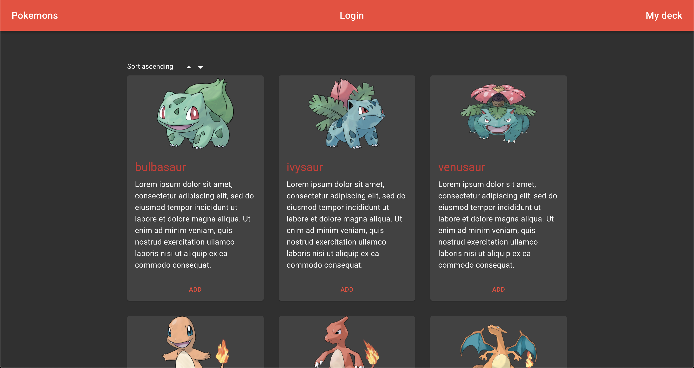
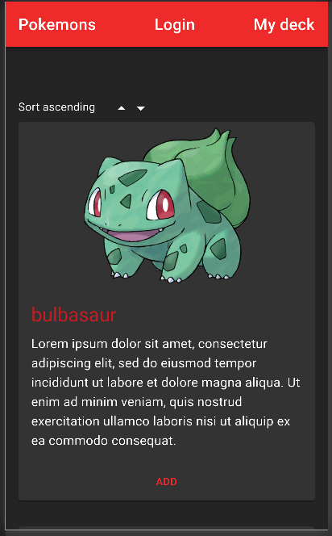
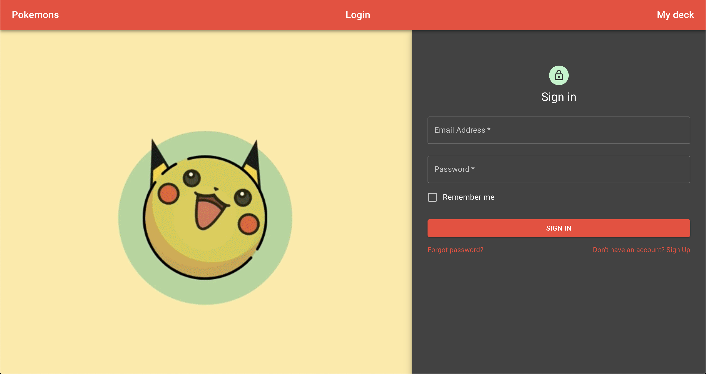
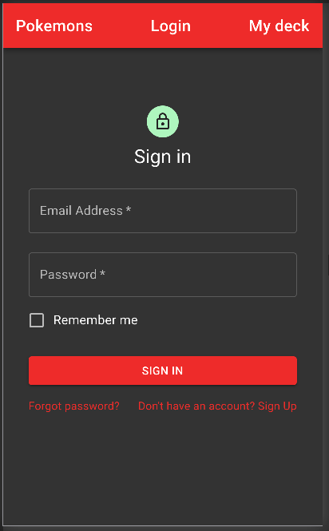
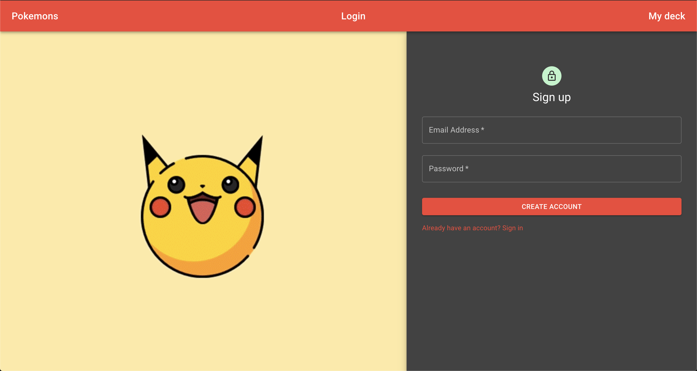
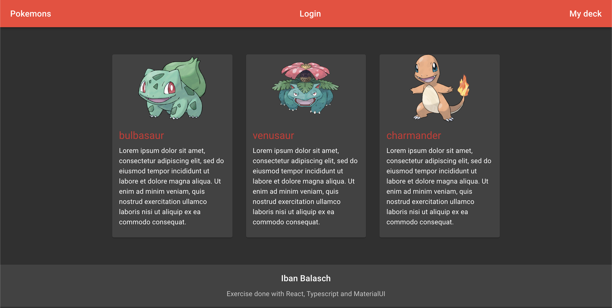

# pokemon exercise

Retrieve information from PokeAPI (https://pokeapi.co) and displayed as a card list. Implemented sort (no filter) and pokemon's deck


## Summary

### Requirements

#### Backend

- Develop a REST API (NodeJS and Express (using node and express) with:
- A registration endpoint for users
- Add and delete Pokemons from a user Pokedex (only if authenticated and limited to 5/user)
- A user can only see his Pokedex
- The API only exposes information on the user language (default to English)
- “Base” attributes should come only in the get of a single resource, not in the list

#### Frontend

- Develop a frontend application with:
- A login
- Navigate the catalog of Pokemons (sortable and filterable)
- Browse Pokedex
- Add/delete Pokemons to the user Pokedex from catalog

### Comments

- Instead using the JSON located at https://github.com/fanzeyi/pokemon.json/blob/master/pokedex.json, I used PokeAPI to get more information about Pokemons
- I have another Github's repository that fit with the requirements too and I think that will be good as an example https://github.com/ibanjb/code-creativity (development branch)

### Missing requirements

Due to the short time (was done in last than 3 hours) that I have to perform this exercise, some of the requirements cannot be done:

- Filter Pokemons in the frontend side
- Base atributes doesn't come from a single resource, they are retrieving from the same API call
- Include unit tests for both (backend and frontend)

## Screenshots

### Pokemons

Desktop:  


Mobile:  


### Login

Desktop:  


Mobile:  


### Register (sign up)

Desktop:


### Pokemon's deck

Desktop:


## Steps to run it locally

There are two folders called 'server' and 'client'. You will need to install the dependencies in both and, to execute it, use the command 'start' for both too. The frontend will be execute in the port 3000, the backend is executed in the port 8080.

### Install dependencies

```sh
yarn
```

### Run react project

```sh
yarn start
```
